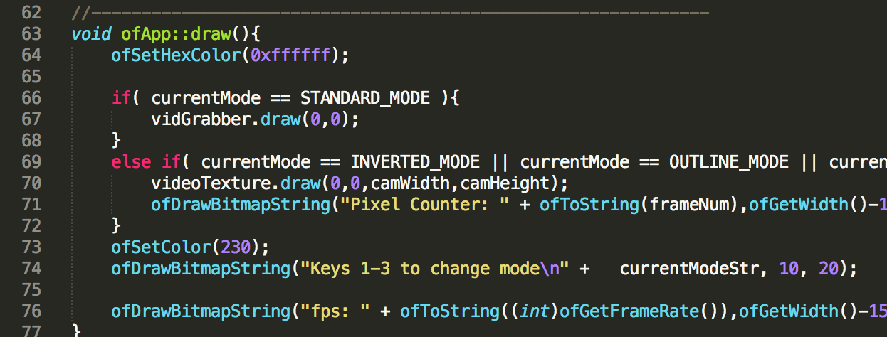

<body class="c4">
Leo Schultz

11/4/14

Parallel Programming Project

Real-time Video Filtering

Abstract:

Photo and video filters are common in all modern graphics applications, some popular applications include Instagram and Photo Booth. Performance is most important when streaming real-time video. I found when processing images it was such fractions of a second in performance differences, it almost didn&rsquo;t make a difference if the program was optimized; therefore, I decided to try filtering a real-time video feed, where performance would be measured in the amount of frames per second the computer could output the video feed to the screen. I started with a simple RGBA bit flipping algorithm for the filters and used OpenGL to parallelize the algorithm, then tested the different results on both a 15 inch Macbook Pro with on board graphics and a 27 inch iMac with an NVIDIA graphics card. 

Introduction:

The problem can be solved in many ways most of these all use OpenGL. You can use sequential bit flipping of the RGBA values; however, in real-time video the feed comes close to breaking. This may be acceptable for some very low power computing devices where you don&rsquo;t have access to a GPU or multi-core processor. However, it does not work very well for real-time video slowing the computers feed down to 3 to 7 frames per second the eyes refresh rate can easily catch the effects low performance and the CPU is highly taxed slowing down the computers resources.

I choose the middle performance implementation to limit scope and increase portability of the application. I used a sequential for loop to populate an array; however, I passed the array back to OpenGL to parallelize the output vector which filters the video feed. A slightly higher performance way of using OpenGL would have been to use GSLS shaders with the OpenGL library; however, GSLS has an intense learning curve and I was not able to get around to implementing GSLS because I had a large scope with using the video live video feed already.

The highest performance way which would have been extremely parallel, but only portable to NVIDIA machines is using the CUDA kernel to parallelize the bit flipping algorithm one more step by assigning separate blocks and then doing vector math on the addition. This could still use OpenGL; however, it would be a lower level implementation requiring a lot of time to implement and debug for an unportable result.

Implementation:

In the header file I declared the dependant frameworks, all of the global functions I was using and the global variables used. I am calling many dependent frameworks from open framework which has a scaffolding for OpenGL libraries and framework which I call from the &ldquo;ofMain.h&rdquo;.

In the &ldquo;main.cpp&rdquo; file I call the main function where I set the window size to the 2880 x 1800 pixel ratio of the Apple Retina display. I do this intentionally because the windows pixel width requires for increased processing of the bits. This gives me a display window controlled by OpenGL which is critical to the application. I also call an &ldquo;ofRunApp();&rdquo; where I declare the app to be in the &ldquo;ofApp.cpp&rdquo; file.

I then built a setup function for the ofApp file. In the setup I populate a vector with the video feed with the vidGrabber library and then allocate the pixels in the vector to the GL_RGB function.

I then built an update function for the ofApp file. I first set a global background window then called in the video grabber function to update in real-time. I then set some local variable which grab pixels just to have a structure to flag off of to send back flag back to the vector structure that was called in the setup function. I create three filters by bit flipping pixels in an array and then send the array back to the video texture using GL_RGB.

For a controller I built a keyPressed function I set on &lsquo;spacebar&rsquo; to a reset function, I set the keys &lsquo;1, 2 and 3&rsquo; to toggle variables which pass back to the update function to control the computations also for the draw functions to control the OpenGL rendering engine.

Last I build a &ldquo;draw&rdquo; function to render out the results created by the computations in the update function. I render out the standard video feed, which can be replaced with the textured feed, then the framerates and control values.

Results:

Standard Video Output at 60 fps

iMac w/NVIDA Graphics Card -

With filter after Parallelization = 22 fps

With filter before Parallelization = 7 fps

Macbook w/On-Board Graphics- 

With filter after Parallelization = 15fps

With filter before Parallelization = 3 fps

References:

<a class="c3" href="http://www.google.com/url?q=http%3A%2F%2Flnx.cx%2Fdocs%2Fopengl-in-xcode%2F&amp;sa=D&amp;sntz=1&amp;usg=AFQjCNFk5h8P2SkC_uSklFkGyWAwqPyvMA">http://lnx.cx/docs/opengl-in-xcode/</a>

<a class="c3" href="http://www.google.com/url?q=http%3A%2F%2Fwww.lighthouse3d.com%2Ftutorials%2Fglut-tutorial%2F&amp;sa=D&amp;sntz=1&amp;usg=AFQjCNFjT1Kf3eTQgKzyb1kav1bAuuyRiA">http://www.lighthouse3d.com/tutorials/glut-tutorial/</a>

<a class="c3" href="http://www.google.com/url?q=http%3A%2F%2Fwww.openframeworks.cc%2F&amp;sa=D&amp;sntz=1&amp;usg=AFQjCNGgny0hOcjCDe6l-1m38W4vxfshdA">http://www.openframeworks.cc/</a>

<a class="c3" href="https://www.google.com/url?q=https%3A%2F%2Fwww.opengl.org%2F&amp;sa=D&amp;sntz=1&amp;usg=AFQjCNEXl0b-OQkEENsOBuYZLp0Ajq41XQ">https://www.opengl.org/</a>

<a class="c3" href="https://www.google.com/url?q=https%3A%2F%2Fwww.opengl.org%2Fresources%2Flibraries%2Fglut%2F&amp;sa=D&amp;sntz=1&amp;usg=AFQjCNHiwDcxTs_gxOZmzG3dWb8t3hJ-7g">https://www.opengl.org/resources/libraries/glut/</a>

<a class="c3" href="http://www.google.com/url?q=http%3A%2F%2Fglew.sourceforge.net%2F&amp;sa=D&amp;sntz=1&amp;usg=AFQjCNH2b74PPTOeKGN2jj3eQVNiQ2nE0Q">http://glew.sourceforge.net/</a>

Appendix:

Project Source Code located at <a class="c3" href="http://www.google.com/url?q=http%3A%2F%2Fwww.github.com%2Fleorue%2Fvideofilter%2F&amp;sa=D&amp;sntz=1&amp;usg=AFQjCNEaukzV_zdBjTxoPdhi0gzGYoKpLQ">http://www.github.com/leorue/videofilter/</a>

</body>